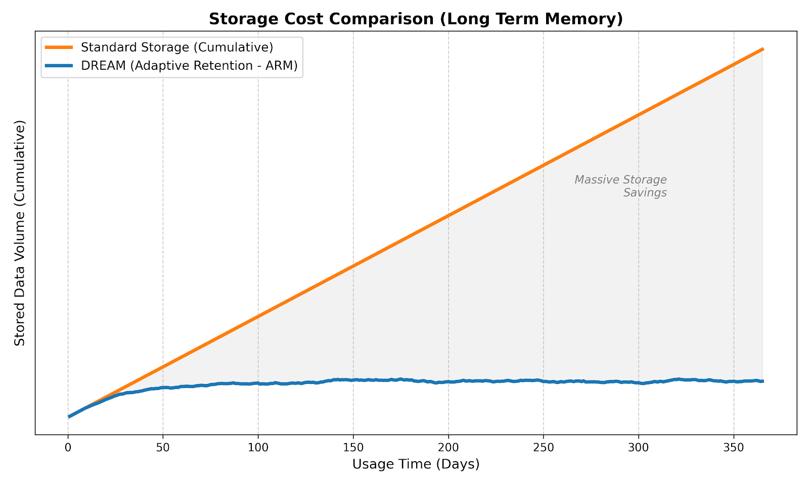
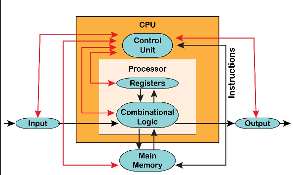
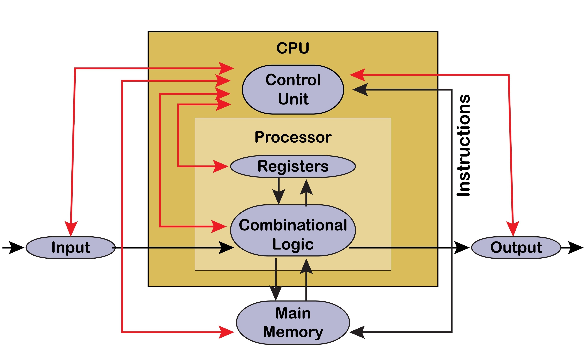

# DREAM Architecture (v2.0)
**D.R.E.A.M. — Dynamic Retention Episodic Architecture for Memory**

[](https://github.com/MatheusPereiraSilva/dream-architecture/releases)
[](./evaluation)
[](https://doi.org/10.5281/zenodo.17619917)

DREAM is an episodic memory design pattern for AI systems, created to address a core limitation of Large Language Models (LLMs):  
their inability to maintain long-term, relevant, low-noise contextual memory without degrading performance.

> **v2.0 Update:** This repository contains the reference implementation featuring the **Adaptive Retention Mechanism (ARM)** with Soft Delete (Tiered Storage) and mathematical validation of O(1) computational costs.

📄 **Official Paper:**  
https://doi.org/10.5281/zenodo.17619917

Note: The linked paper refers to v1.0. The v2.0 addendum with empirical validation is currently available in this repository's `evaluation/` folder and will be published formally in 2026.

---

## 📌 Overview

DREAM proposes a scalable, adaptive, user‑oriented memory architecture built on four pillars:

### **1. Episodic Units (EUs)**

Compact memory units containing summary, embedding vector, topic, and lifecycle metadata. EUs serve as the atomic unit of long-term storage.

---

### **2. Opt‑in per Episode**
Every episode is stored **only if explicitly confirmed**. This eliminates noise, vector pollution, and hallucination reinforcement.  

---

### **3. ARM — Adaptive Retention Mechanism (Tiered Storage)**
Inspired by human memory retention, ARM dynamically adjusts the Time-To-Live (TTL) based on engagement:

```
TTL_days = min(MAX_DAYS, 7 * (2 ** visits))
```

- **Active Tier:** Frequently reused memories gain longevity. 
- **Dormant Tier (Soft Delete):** Unused memories move to Cold Storage instead of immediate deletion, preserving user trust while saving compute costs. 

---

### **4. Sharded Orchestration**
Horizontal scalability strategy (`shard_id = hash(user_id) % N`) ensures user isolation and efficient distribution across orchestrators.

---
## 📊 Empirical Validation (New in v2.0)
We proved via simulation that DREAM solves the "Infinite Log" problem. Check the `evaluation/` folder for the full Jupyter Notebooks.

| Computational Cost (Energy)                                                          | Storage Cost (Sustainability)                                                 |
|--------------------------------------------------------------------------------------|-------------------------------------------------------------------------------|
| <br/>DREAM maintains O(1) cost vs O(n²) of Transformers | <br/>ARM stabilizes storage growth via self-pruning |

---

## 🖼 Architecture Diagrams
**Memory Read Flow**



**Memory Write & Update Flow** 



(Full high-resolution diagrams available in the paper)

---

## 🚀 Quick Start (DREAM-Lite)

Run the simulation agent locally without any complex infrastructure:

1. **Install dependencies:**
```commandline
pip install -r requirements.txt
```
2. **Run the demo:**
```commandline
python main.py
```
3. **Observe the ARM in action:** You will see logs demonstrating the Soft Delete and TTL
**Renewal** process:
```commandline
[ORCH] ✅ Memory saved: 'User likes Python' (ID: a1b2c3d4)
[ARM] 🔄 TTL renewed: +14 days (Revisit #1)
[ARM] ❄️ TTL expired. Memory moved to Cold Storage.
[ORCH] ⚠️ Memory was DORMANT. Reactivating...
```

---

## 🎯 What DREAM Solves

LLMs suffer from:
- context window limitations  
- forgetting over long interactions  
- memory noise accumulation  
- vector databases becoming polluted  
- poor “auto‑RAG” strategies  
- lack of semantic importance differentiation  

DREAM solves these through:
- episodic units  
- TTL based on actual usage  
- explicit memory decisions  
- adaptive retention  
- per‑user isolation  
- lean and clean vector‑based retrieval  

---

## 🏗 Repository Structure

```
dream-architecture/
   Version 1-0/    
      dream/                      ← DOMAIN LAYER
        models.py
        interfaces.py
        summarization.py
        embedding.py
        store.py
        arm.py
        orchestrator.py
    
      app/
        config.py                 ← CONFIG LAYER
        llm_clients.py            ← LLM ADAPTERS
        vector_clients.py         ← VECTOR STORE ADAPTER
        memory_service.py         ← APPLICATION LAYER
        api/                      ← INTERFACE LAYER (FastAPI)
         main.py
         routes_memory.py 
      __init__.py
   
  core/
    __init__.py
    arm.py
    orchestrator.py
    summarizer.py
  evaluation/
    ARM_simulation.py
    energy_cost_simulation.py
  memory/
    __init__.py
    episodic_db.py
    retrieval.py
    vector_db.py
  models/
    __init.py
    episodic_unit.py
  main.py
  requirements.txt
    
  examples/
    simple_demo.py            ← USAGE EXAMPLE
  
  dream_extensions/
    arm_topic.py
    retrieval_strategies.py
    store_cassandra.py
    store_pgvector.py
    store_pinecone.py
    store_qdrant.py
  
  docs/
    extensions/
      DREAM-as-a-Service/
        DREAM+SupermemoryExplanation.md
        dream_orchestratot.py
        main.py
        services.py
      ARM_TopicAware.md
      RetrievalStrategies.md
      VectorStoreAdapters.md
```
---

## ⭐ What Makes DREAM Unique

- **O(1) Inference Cost:** Decouples memory size from LLM context window.  
- **Self-Pruning:** TTL based on real usage, not arbitrary dates.  
- **Safety Net:** "Soft Delete" ensures users don't lose memories accidentally.  
- **Privacy-First:** Explicit opt-in per episode.  
- **Agnostic:** Compatible with any Vector DB (Chroma, Pinecone, pgvector) and LLM.  
 
---

“DREAM supports any vector storage backend. Examples provided include pgvector, Qdrant, Pinecone, and Cassandra.
The architecture remains fully independent of underlying technologies.”
---

## 🙌 Contributing

Pull requests are welcome!  
Ideas for new adapters, enhancements to ARM, or improved retrieval strategies are especially appreciated.

---

## 📜 License
Creative Commons Attribution 4.0 International


